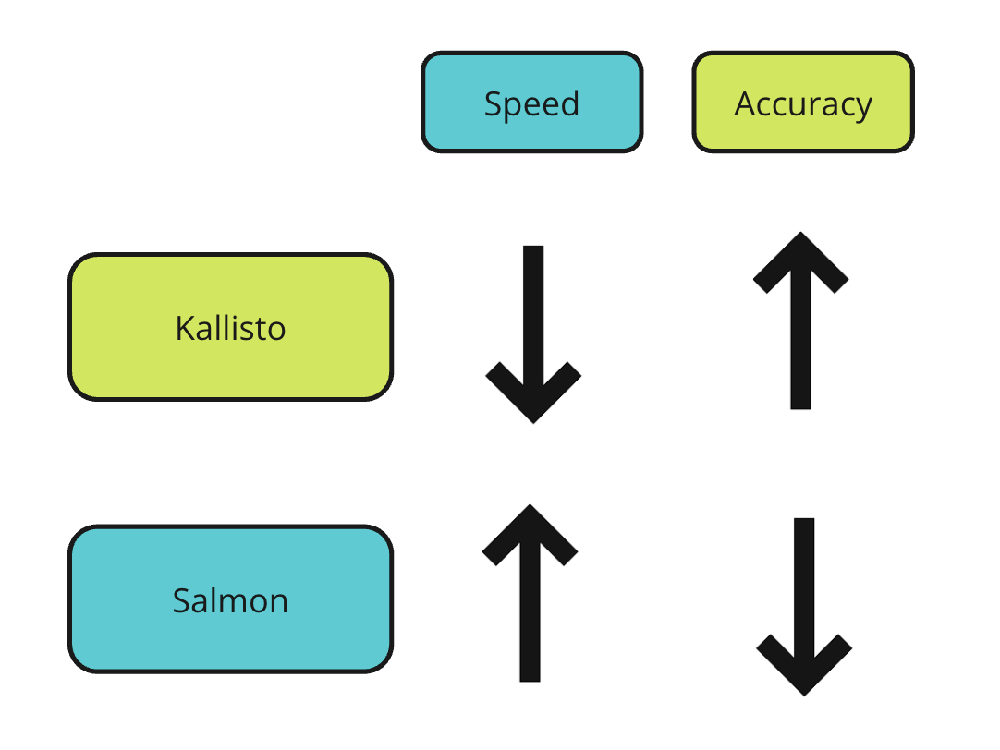
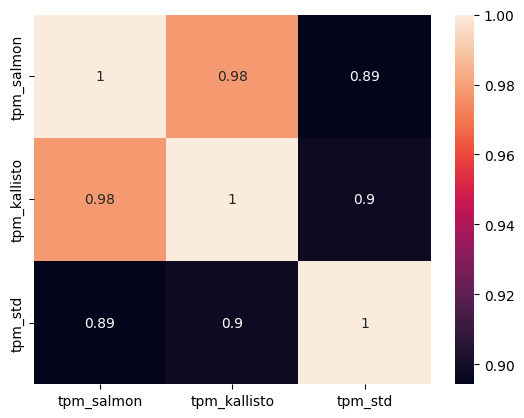

# Project

## Sections as stated in guidelines:

- The goal of the project or problem addressed
- The approach you took, including tools that you downloaded or used and a description of the code you wrote.
- A description of your results
- A discussion of anything you might do to expand upon or improve your project.

## Purpose:

The primary objective of this project is to compare Kallisto and Salmon sequencing tools in terms of their algorithmic differences, speed, and accuracy in quantifying transcript abundances. Specifically, I aim to:
1. Investigate the algorithmic differences between Kallisto and Salmon, focusing on their underlying methodologies for transcript abundance estimation.
2. Evaluate the speed differences between Kallisto and Salmon in generating index files and quantifying transcript abundances using commands like time (terminal).
3. Assess the accuracy of Kallisto and Salmon by comparing their results to publicly available processed data from the ENCODE project.

## Approach (tools, code description)

Download RNAseq data from ENCODE, which is small, and also has processed results on ENCODE to compare our results to.

reads (fastq) file being downloaded: ENCFF765REV, ENCFF339UJI (paired end)
standard transcript quantifications: ENCFF039UNR

command used to build salmon index: `time salmon index -t Homo_sapiens.GRCh38.cdna.all.fa.gz -i salmon_index`

command used to build kallisto index: `time kallisto index -i kallisto_index/index.idx Homo_sapiens.GRCh38.cdna.all.fa.gz Homo_sapiens.GRCh38.111.gtf.gz` : took 11 mins

#### kallisto quantification:

command run:
`time kallisto quant -i index_files/kallisto_index/index.idx -o kallisto_output ENCFF765REV.fastq.gz ENCFF339UJI.fastq.gz`
took 12 minutes

#### salmon quantification

command run:
`time salmon quant -i index_files/salmon_index -l A -1 ENCFF765REV.fastq.gz -2 ENCFF339UJI.fastq.gz --validateMappings -o salmon_output`
took 10 minutes

## Results

#### Basic Algorithm differences

Kallisto creates a De Bruijn Graph which efficiently stores the possible k-mers of the reference transcriptome. It maps the reads to the transcripts using the possible k-mers from the reads. Finally, it employs an iterative Expectation-Maximization algorithm to find out the transcripts quantification which has the maximum likelihood given the set of reads we have.

Salmon on the other hand employs a two step approach to quantify transcripts. The first step is an online step in which the initial expression levels of the transcripts and model parameters are estimated. The next is the offline step in which fine tuning of the model parameters and expression estimates happen.
Salmon builds a probabilistic model of the data, taking into account various factors which influence the probability of a read arising from a particular transcript. Kallisto doesn't take these factors into account.

### About times

Kallisto was the slower method of the two in both, making the index and quantifying the transcript abundances.

It took around 11 minutes to build the index, unlike 2 minutes taken by salmon.

Transcript quantification using kallisto took around 12 minutes, whereas salmon took around 10 minutes to do the same.

### Accuracies

In my analysis, kallisto compensated for being slow by slightly more accuracy in transcript quantifications compared to salmon. 

Although Salmon claims to be more accurate than kallisto, I found it to be slightly less similar to the quantifications from a proper alignment strategy (alignment using STAR followed by quantification using RSEM). Hence, at least in my analysis, Salmon was the lesser accurate method (Assuming the standard method to be the gold standard of accuracy).

The correlation (measured using .corr() method of pandas dataframe, which defaults to calculating pearson correlation) was the statistic used to measure similarity between the results of the different methods.

## Further Improvements

- In this analysis, I have just considered one datapoint (total RNA seq sample from the HepG2 cell line in Homo Sapiens) to compare Salmon and Kallisto. However, to get more confident results, more datapoints are required. 
- There are many more modes of RNA sequencing (paired end, single cell etc.). In this case, it is paired end bulk sequencing, but the other modalities may yield different results when the two tools are compared. 
- Also, since a big advantage of Salmon is that it considers many different types of biases in the fastq files in the quantification, which kallisto doesn't, if the file doesn't have much bias to begin with, Salmon is at a disadvantage in the comparison.

## References
- https://salmon.readthedocs.io/en/latest/salmon.html
- https://pachterlab.github.io/kallisto/manual
- https://www.encodeproject.org/

